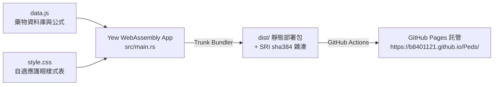

# 👶 PedsRx - 兒科常用藥快速查詢與劑量精算系統

[](https://github.com/b8401121/Peds/actions/workflows/deploy.yml)
[](https://www.rust-lang.org/)
[](https://webassembly.org/)
[](https://yew.rs/)
[](#-subresource-integrity-sri-安全機制)

> 專為兒科醫師、住院醫師、實習醫學生與臨床藥師設計的**兒科常用藥物快速查詢與體重劑量精算工具**。  
> 採用 **Rust + WebAssembly (Yew 框架)** 打造，無伺服器後端負擔，100% 靜態運行於瀏覽器端，具備極致效能與嚴密資安防護。

🌐 **線上使用網址**：[https://b8401121.github.io/Peds/](https://b8401121/Peds/)

---

## 📖 目錄

1. [功能特色](#-功能特色)
2. [介面操作說明書](#-介面操作說明書)
3. [技術架構與原理](#-技術架構與原理)
4. [專案目錄結構](#-專案目錄結構)
5. [本機開發與建置指引](#-本機開發與建置指引)
6. [藥物資料庫維護指南 (data.js)](#-藥物資料庫維護指南-datajs)
7. [Subresource Integrity (SRI) 安全機制](#-subresource-integrity-sri-安全機制)
8. [GitHub Actions CI/CD 自動發佈](#-github-actions-cicd-自動發佈)

---

## ✨ 功能特色

- ⚡ **即時體重動態精算**：輸入體重（支援至小數點第一位），所有卡片立即連動換算出「單次劑量、給藥頻次、每日上限量、換算支數/包數/顆數」。
- 🛡️ **安全上限與雙重警語**：
  - 紅色警語 `⚠`：標註超過仿單極量、年齡禁忌、單次封頂警訊。
  - 橘色警語 `※`：標註處方注意事項、稀釋條件與分流建議。
- 💉 **劑型直覺識別**：口服、針劑（紫色側邊條）、栓劑、外用均配有醒目的視覺標籤。
- 🔍 **全域即時搜尋**：支援藥品商品名、學名、劑型、適應症、臨床症狀模糊比對。
- 📑 **分類目錄導航**：左側選單依系統分流（退燒、呼吸道、腸胃道、抗生素、流感、急救等），附帶即時藥物數量統計。
- 👁️ **三合一護眼主題**：
  - 🌿 **柔和護眼灰（預設）**：低亮度柔和冷灰調，消除螢幕白光刺眼感。
  - 📖 **暖米紙調（Kindle 風格）**：仿實體醫學指引紙張色澤。
  - 🌙 **深色夜間模式**：夜班值班或昏暗診間必備，零眩光。
- 📱 **RWD 響應式手機排版**：全面針對 iPhone 與 Android 手機觸控操作最佳化，點擊體重直接喚起數字鍵盤。

---

## 🖥️ 介面操作說明書

### 1. 體重輸入與微調
- 在頂部標題列的 **「體重」** 輸入框中輸入病人公斤數（例如 `12.5`）。
- 亦可點擊右側的 `[−]` 與 `[＋]` 按鈕以 1 kg 為單位快速增減。
- 體重輸入後，下方所有藥物卡片的計算區塊會自動顯示出精算結果。

### 2. 藥物搜尋
- 在搜尋框輸入欲查詢的文字（如 `抗生素`、`退燒`、`amox`、`curam`、`嘔吐`）。
- 搜尋時系統會自動進入全域搜尋模式，並過濾出符合條件的藥物卡片。

### 3. 分類導航（電腦與手機）
- **電腦版**：點擊左側目錄的分類項目（如 `呼吸道症狀` -> `止咳`），主畫面將自動切換至該分類。
- **手機版**：點擊左上角 `[☰ 分類]` 漢堡按鈕，即可滑出抽屜選單進行分類選擇。

### 4. 護眼配色切換
- 點擊頂部右上角的 **配色切換按鈕**（標示為 `🌿 柔和護眼` / `📖 暖米色調` / `🌙 深色夜間`），可即時循環切換配色。

---

## 🛠️ 技術架構與原理



- **核心前端框架**：[Yew (v0.21)](https://yew.rs/) - 以 Rust 編寫的高效能客戶端 Web 框架。
- **WebAssembly 橋接**：`wasm-bindgen` + `js-sys` - 實現 Rust 核心與 JS 計算函數的高效互操作。
- **建置工具**：[Trunk](https://trunkrs.dev/) - 專為 Rust WASM 設計的打包器，負責編譯 WASM、處理 CSS 資源與注入 SRI 雜湊。
- **樣式引擎**：原生純 CSS3，採用現代 CSS 變數（CSS Variables）與 CSS Grid/Flexbox 佈局，無外部大型 UI 庫依賴，體積輕巧、載入極快。

---

## 📂 專案目錄結構

```text
peds-calc-rust/
├── .agents/
│   └── skills/
│       └── peds-rx/
│           └── SKILL.md         # Antigravity 專案專屬維護 Skill
├── .github/
│   └── workflows/
│       └── deploy.yml           # GitHub Actions CI/CD 自動部署腳本
├── docs/
│   └── USER_MANUAL.md           # 詳細使用者操作手冊
├── src/
│   └── main.rs                  # Rust Yew 應用程式主邏輯
├── Cargo.toml                   # Rust 套件依賴設定檔
├── Cargo.lock                   # 依賴版本鎖定檔
├── data.js                      # 藥物資料庫與劑量計算公式引擎
├── index.html                   # 應用程式入口 HTML (含 Trunk 標籤與 SRI 設定)
├── style.css                    # 響應式排版與護眼主題樣式表
└── README.md                    # 本說明文件
```

---

## 💻 本機開發與建置指引

### 必備環境
1. 安裝 [Rust 工具鏈](https://www.rust-lang.org/tools/install)
2. 新增 WebAssembly 編譯目標：
   ```bash
   rustup target add wasm32-unknown-unknown
   ```
3. 安裝 Trunk 打包工具：
   ```bash
   cargo install trunk
   ```

### 開發指令

- **編譯檢查**：
  ```bash
  cargo build --target wasm32-unknown-unknown
  ```
- **啟動本機開發伺服器（支援熱重載 Hot-Reload）**：
  ```bash
  trunk serve
  ```
  啟動後開啟瀏覽器造訪 `http://127.0.0.1:8080` 即可進行即時預覽與除錯。

- **編譯正式發佈版本（Release Build）**：
  ```bash
  trunk build --release --public-url /Peds/
  ```
  編譯完成後，靜態產物將輸出至 `dist/` 目錄。

---

## 💊 藥物資料庫維護指南 (`data.js`)

所有的藥品資訊與計算邏輯均集中在 `data.js` 檔案中的 `DATA` 陣列。

### 藥物卡片資料欄位規格

```javascript
{
  n: '藥品商品名 (學名) 規格 劑型',  // 藥品名稱（若以 ★ 開頭則卡片會帶有金黃色高亮標籤）
  rt: '針劑',                       // 劑型標籤：'針劑' | '栓劑' | '外用' | '' (口服)
  s: '成分含量｜給藥途徑｜適應症條件',  // 卡片副標題
  w: '台灣仿單警語與極量上限說明',    // 嚴重安全性警語（紅框 ⚠）
  wm: '處方與臨床使用注意事項',       // 一般注意事項（橘框 ※）
  f: '(BW/12.5) 顆',                // 常用速算簡化公式
  m: [                             // 臨床解說條列清單 (支援 <b> 粗體標籤)
    'Max 1 顆/dose；一日最多 3 次',
    '一般開 3–5 顆回家'
  ],
  r: [                             // 參考文獻與仿單連結 (可選)
    ['非炎栓劑仿單', 'https://kb.commonhealth.com.tw/drugs/8029.html']
  ],
  calc: BW => [                    // 體重計算函數 (BW: 病人體重 kg)；若無計算公式則設為 null
    {
      lbl: '每次劑量',              // 計算列標題
      big: r1(BW / 12.5) + ' #',   // 計算數值 (r1: 四捨五入至小數點一位)
      freq: 'Q8H PRN',             // 給藥頻次膠囊
      flag: BW / 12.5 > 1 ? '已達單次上限 1 顆' : null // 警訊旗標 (超過上限時觸發)
    },
    {
      lbl: '每日上限',
      big: '37.5 mg',
      freq: '≤3 mg/kg/day',
      sub: true                    // 設為 true 則以次要附註列呈現
    }
  ]
}
```

---

## 🔒 Subresource Integrity (SRI) 安全機制

本專案全面導入 **SRI (子資源完整性)** 安全防護標準：
- 在 `index.html` 中以 `data-integrity="sha384"` 宣告 WASM、JS 與 CSS 資源。
- Trunk 在建置時會自動計算各檔案的 SHA-384 雜湊值，並注入到最終發佈的 HTML `<script>` 與 `<link>` 標籤中。
- 確保使用者載入的程式碼未遭受任何 CDN 節點竄改或中間人攻擊（MITM）。

---

## 🚀 GitHub Actions CI/CD 自動發佈

專案已配置完整的自動化持續整合與部署工作流（`.github/workflows/deploy.yml`）：
- 只要將程式碼推送到 GitHub `master` 分支，GitHub Actions 就會自動啟動 Ubuntu 容器。
- 自動安裝 Rust `wasm32` 工具鏈與 Trunk。
- 自動執行 `trunk build --release --public-url /Peds/` 打包並產出含 SRI 雜湊的 `dist/` 目錄。
- 自動將產物部署至 GitHub Pages 靜態網站。

---

## 📄 授權與聲明

- 本程式所提供之劑量計算、臨床說明與警語僅供醫療專業人員參考，實際處方開立仍應以病人臨床狀況、最新藥品仿單與各醫療院所處方規範為準。
